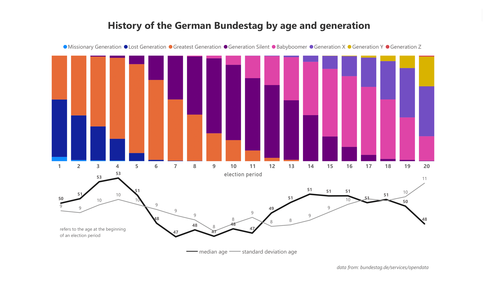
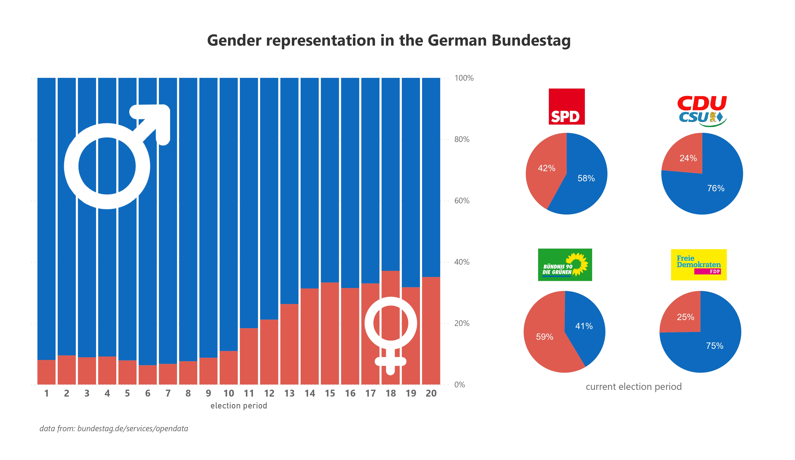
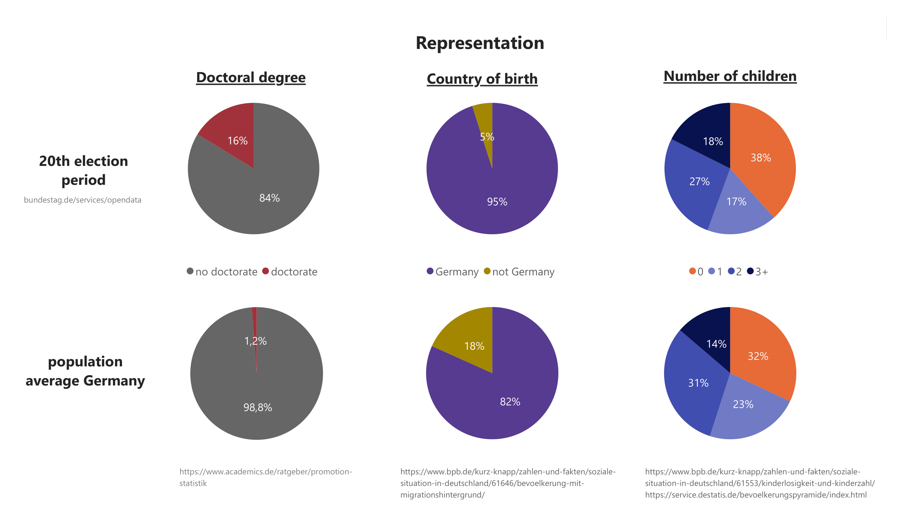

# Analysis of the demographics of the German Bundestag

## The data set
I used a data set from the German government's Open Data, which includes all members of the Bundestag from 1949 to today: https://www.bundestag.de/services/opendata
(as of 05.09.2023). 

## Data wrangling
The data was stored in an XML file which I first processed using **Python**. The main steps were:
- creating a dataframe with only the data I’m interested in
- some data wrangling like changing data types and dealing with missing data
- exporting the dataframe to a PostgreSQL database

The Jupyter Note is available [here](JupyterNB_Bundestag.ipynb).

## Data model and visualization
I used the imported dataframe to create a normalized data model and imported the data into a **PostgreSQL database** which I could later easily connect to **Power BI**. 

The sql file is available [here](SQL_Bundestag.sql).

The Power BI file is available [here](PBI_Bundestag.pbix).

## Results
I did not have a specific research question in mind but rather wanted to play around with Power BI and come up with some striking and easy-to-read visualizations. 

#### *Age*
The most obvious things to look at are age and gender. I have assigned a generation to each person and plotted the proportions of each generation over all election periods. This looks cool, but admittedly not very informative. So I added the median age and the standard deviation. 

The current Bundestag is the youngest since 1990 and has the largest standard deviation, meaning highest age diversity, ever.

#### *Gender*
The evolution of the gender shares is, not surprisingly, in favour of men. However, I was surprised that the proportion of women has not changed much over the last 6 electoral periods (that's 2002!).

#### *Representation*
I wanted to use some other available data to illustrate representation by comparing the current Bundestag to average population data.

As expected, the proportion of people with a doctorate degree is much higher among member of the Bundestag than in the general population. The significantly lower proportion of people born outside Germany is not surprising but still possibly problematic in terms of representation. The number of children of members of the Bundestag differs only slightly from that of the population as a whole.

